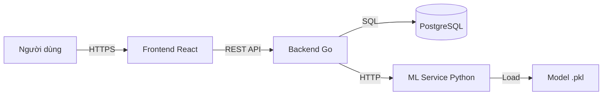

# Tài Liệu Tổng Quan Dự Án: Hệ Thống Dự Đoán Nguy Cơ Bệnh Tim Mạch

## 1. Giới Thiệu
Dự án là một hệ thống toàn diện giúp dự đoán nguy cơ mắc bệnh tim mạch dựa trên các chỉ số sức khỏe của bệnh nhân. Hệ thống kết hợp giữa ứng dụng web hiện đại, backend mạnh mẽ và mô hình học máy (Machine Learning) để đưa ra các dự đoán chính xác và gợi ý tập luyện phù hợp.

## 2. Kiến Trúc Hệ Thống
Hệ thống được thiết kế theo kiến trúc Microservices, bao gồm 3 thành phần chính:

1.  **Frontend (Client)**: Giao diện người dùng tương tác.
2.  **Backend API (Go)**: Xử lý nghiệp vụ, quản lý dữ liệu và kết nối các dịch vụ.
3.  **ML Service (Python)**: Dịch vụ chuyên biệt chạy mô hình AI để dự đoán.
4.  **Database (PostgreSQL)**: Lưu trữ dữ liệu bền vững.

### Sơ đồ luồng dữ liệu cơ bản:


## 3. Công Nghệ Sử Dụng (Tech Stack)

### 3.1. Frontend (`TimMach_client`)
*   **Core**: React 18, TypeScript, Vite.
*   **Styling**: Tailwind CSS, Lucide React (Icons).
*   **State Management**: Zustand, React Query (@tanstack/react-query).
*   **Form Handling**: React Hook Form, Zod (Validation).
*   **Auth**: Keycloak JS (OIDC/OAuth2).
*   **Visualization**: Recharts (Biểu đồ).

### 3.2. Backend (`TimMach_api`)
*   **Language**: Go (Golang) 1.24.
*   **Framework**: Gin Web Framework.
*   **Database Driver**: pgx/v5.
*   **ORM/Query Builder**: SQLC (Type-safe SQL).
*   **Auth Middleware**: Keycloak integration.
*   **Utilities**: Go-wkhtmltopdf (PDF generation), Gomail (Email), Zap (Logging).

### 3.3. ML Service (`ml-python`)
*   **Language**: Python.
*   **Framework**: FastAPI.
*   **ML Libraries**: Scikit-learn, Pandas, Joblib.
*   **Model**: RandomForest (lưu dưới dạng `.pkl`).

### 3.4. Infrastructure
*   **Database**: PostgreSQL.
*   **Containerization**: Docker, Docker Compose.

## 4. Cấu Trúc Thư Mục

```
DeXuatBaiTap/
├── TimMach_api/            # Source code Backend
│   ├── config/             # Cấu hình hệ thống
│   ├── db/                 # Migration và SQL queries
│   ├── middleware/         # Middleware (Auth, CORS...)
│   ├── modules/            # Logic nghiệp vụ (Users, Patients, Predictions...)
│   └── main.go             # Entry point
├── TimMach_client/         # Source code Frontend
│   ├── src/
│   │   ├── api/            # Cấu hình Axios/API client
│   │   ├── components/     # UI Components tái sử dụng
│   │   ├── modules/        # Màn hình và logic theo tính năng
│   │   └── main.tsx        # Entry point
├── ml-python/              # Source code ML Service
│   ├── training/           # Notebook và model training
│   └── main.py             # API server cho model
├── docker-compose.yml      # File cấu hình chạy toàn bộ hệ thống
└── docs/                   # Tài liệu dự án
```

## 5. Các Tính Năng Chính

### 5.1. Quản Lý Người Dùng & Xác Thực
*   Đăng nhập/Đăng ký thông qua Keycloak (SSO).
*   Phân quyền truy cập API.

### 5.2. Quản Lý Bệnh Nhân (`modules/patients`)
*   Thêm, sửa, xóa, xem danh sách bệnh nhân.
*   Lưu trữ thông tin cá nhân: Tên, tuổi, giới tính, ngày sinh.

### 5.3. Dự Đoán Nguy Cơ (`modules/predictions`)
*   Nhập các chỉ số y tế: Huyết áp, Cholesterol, Đường huyết, BMI, thói quen hút thuốc/rượu bia...
*   Gửi dữ liệu sang ML Service để phân tích.
*   Nhận kết quả: Xác suất mắc bệnh, Mức độ rủi ro (Low/Medium/High), Các yếu tố nguy cơ chính.
*   Lưu lịch sử dự đoán.

### 5.4. Gợi Ý Tập Luyện (`modules/exercises`)
*   Dựa trên kết quả dự đoán và chỉ số sức khỏe, hệ thống đưa ra phác đồ tập luyện.
*   Gợi ý bài tập, cường độ, thời gian phù hợp.

### 5.5. Báo Cáo & Thống Kê (`modules/reports`, `modules/stats`)
*   Xem thống kê tổng quan (Dashboard).
*   Xuất báo cáo kết quả dự đoán (PDF) và gửi qua Email.

## 6. Thiết Kế Cơ Sở Dữ Liệu (Database Schema)

Các bảng chính trong PostgreSQL:
*   `users`: Thông tin tài khoản (đồng bộ với Keycloak hoặc quản lý riêng).
*   `patients`: Hồ sơ bệnh nhân.
*   `predictions`: Lịch sử các lần dự đoán, kết quả và input đầu vào.
*   `exercise_recommendations`: Các gợi ý tập luyện gắn với lần dự đoán.
*   `reports`: Lưu vết các báo cáo đã tạo.

## 7. Hướng Dẫn Cài Đặt & Chạy (Local)

### Yêu cầu:
*   Docker & Docker Compose
*   Go 1.24+ (nếu chạy backend trần)
*   Node.js 18+ (nếu chạy frontend trần)
*   Python 3.9+ (nếu chạy ML trần)

### Cách 1: Chạy bằng Docker (Khuyên dùng)
Tại thư mục gốc dự án:
```bash
docker-compose up --build
```
Hệ thống sẽ khởi động:
*   Frontend: `http://localhost:5173`
*   Backend: `http://localhost:8080`
*   ML Service: `http://localhost:8000`
*   PostgreSQL: `localhost:5432`

### Cách 2: Chạy từng service

**1. Database:**
Đảm bảo PostgreSQL đang chạy và cấu hình trong `.env` của Backend đúng.

**2. ML Service:**
```bash
cd ml-python
pip install -r requirements.txt
uvicorn main:app --reload --port 8000
```

**3. Backend:**
```bash
cd TimMach_api
go mod download
go run main.go
```

**4. Frontend:**
```bash
cd TimMach_client
npm install
npm run dev
```
